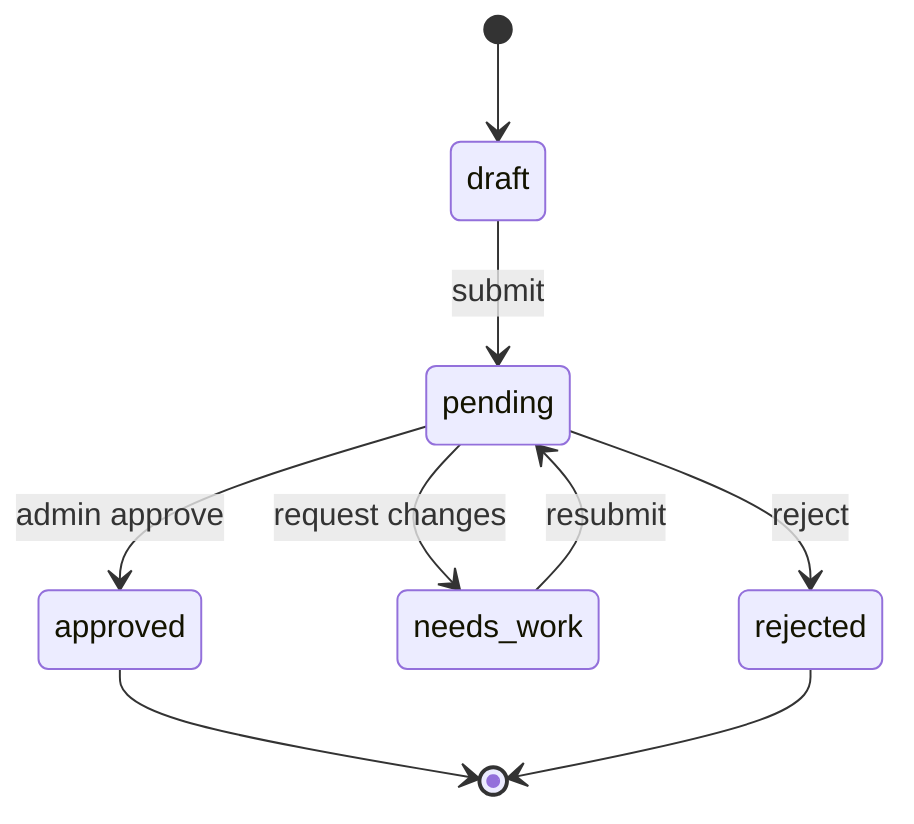

# AgentHub Developer Flow – Implementation Design

Version: 1.0  
Status: Ready for implementation  
Scope: Developer submission and publishing flow from auth → draft → submit → review feedback loop → approved go-live

---

## 1) Objectives & Non‑Goals

- Objectives:
  - Provide a low‑friction submission experience using a multi‑step form with GitHub integration and live preview.
  - Ensure data integrity and review readiness with strong client/server validation.
  - Support drafts, resubmissions, and a clean handoff to the review queue.
  - Keep the design MVP‑simple while extensible for future versioning and richer metadata.
- Non‑Goals:
  - Admin tooling (covered elsewhere).
  - Monetization, billing, or payout flows.
  - Full agent versioning UI (future enhancement).

---

## 2) Assumptions & Requirements

- Auth: NextAuth (GitHub OAuth) with role `user` allowed to submit.
- Database: PostgreSQL via Prisma; baseline schema from publishing-system-design.
- Storage: README sourced from GitHub; screenshots via Cloudinary (optional).
- Validation: Zod on both client and server.
- Rate limits: User ≤10 submissions/day (configurable); server enforces.
- Security: HTML sanitization for any rendered README content.

---

## 3) UX Flow & Screens

1. Publish Entry
   - Entry points: Navigation “Publish”, empty state CTA on `My Agents` page.
   - If unauthenticated, redirect to sign‑in with GitHub; then back to `/publish`.

2. Multi‑Step Submission Wizard
   - Step 1 – Basic Info: name, description, category, tags, use cases.
   - Step 2 – GitHub: repo URL; fetch & validate; fetch README.
   - Step 3 – Docs & Media: auto‑parsed sections; optional screenshots (≤3), demo video.
   - Step 4 – Preview & Submit: live preview of marketplace card and details; confirm & submit.

3. Post‑Submit
   - Status banner shows `Pending Review`; email confirmation sent.
   - Drafts can be saved at any step; pre‑submit autosave every 5s or on blur.

4. Resubmission Loop
   - If `Needs Work`, developer sees structured feedback; can edit and resubmit.

---

## 4) Data Model Interaction

- `users` – current authenticated developer.
- `agents` – top‑level record. `status` transitions: `draft → pending → approved | needs_work | rejected`.
- `agent_metadata` – flexible fields: tags, use_cases, installation_instructions, configuration_options, examples, screenshots, demo_video_url.
- `submission_queue` – submission record with `priority`, timestamps, reviewer linkage, and notes.

Optional near‑term additions (backward compatible):
- `submission_queue.review_status` (pending|in_review|needs_work|approved|rejected)
- `audit_log` for state changes.

---

## 5) Components & Routing (Next.js App Router)

- Route: `/publish`
  - Server component wrapper for auth gating.
  - Renders `PublishWizard` client component.

- Components
  - `PublishWizard` (client): orchestrates steps, local state, autosave.
  - `StepBasicInfo`
  - `StepGitHub`
  - `StepDocsMedia`
  - `StepPreview`
  - `ReadmePreview` (sanitized render)
  - `ScreenshotUploader` (Cloudinary/Vercel Blob)

---

## 6) Validation Schemas (Zod)

```ts
import { z } from 'zod'

export const BasicInfoSchema = z.object({
  name: z.string().min(3).max(255),
  description: z.string().min(30),
  category: z.enum(['Research','Development','Data Science','Analysis','Automation','Other']),
  tags: z.array(z.string().min(1)).max(10).optional().default([]),
  useCases: z.array(z.string().min(5)).max(10).optional().default([])
})

export const GitHubSchema = z.object({
  githubUrl: z.string().url().regex(/github\.com\//i, 'Must be a GitHub URL'),
  owner: z.string().min(1),
  repo: z.string().min(1),
  readme: z.string().min(20)
})

export const DocsMediaSchema = z.object({
  installation: z.string().min(10),
  usage: z.string().min(10).optional().default(''),
  examples: z.array(z.string()).max(5).optional().default([]),
  configurationOptions: z.record(z.any()).optional(),
  screenshots: z.array(z.string().url()).max(3).optional().default([]),
  demoVideoUrl: z.string().url().optional()
})

export const SubmitPayloadSchema = z.object({
  basic: BasicInfoSchema,
  github: GitHubSchema,
  docs: DocsMediaSchema
})
```

---

## 7) API Contracts (Server)

- `POST /api/github/validate`
  - Body: `{ url: string }`
  - Validates: repo exists, public, ownership/collab via GitHub API; returns `{ valid, isPublic, owner, repo }`.

- `POST /api/github/readme`
  - Body: `{ url: string }`
  - Returns README raw content and parsed sections; caches via ETag.

- `POST /api/agents/draft`
  - Body: `Partial<SubmitPayloadSchema>`; creates or updates a draft agent and `agent_metadata` via upsert.
  - Returns `{ agentId, status: 'draft' }`.

- `POST /api/agents/submit`
  - Body: `SubmitPayloadSchema & { agentId?: string }`
  - Server validates all fields; sanitizes HTML; enforces rate limits.
  - Writes `agents` (status `pending`), `agent_metadata` (upsert), and `submission_queue` entry.
  - Returns `{ agent: Agent, status: 'pending' }`.

- `GET /api/agents/:id`
  - Returns agent + metadata for editing/resubmission.

- `POST /api/agents/:id/resubmit`
  - Body: `SubmitPayloadSchema`
  - Sets status `pending`, appends to `submission_queue`, preserves history via `review_notes`.

Error format (consistent):
```json
{
  "error": {
    "code": "VALIDATION_ERROR",
    "message": "Invalid payload",
    "fields": { "basic.name": "Too short" }
  }
}
```

---

## 8) State Machine (Developer‑visible)



Implementation notes:
- Drafts are editable; only owner can submit/resubmit.
- Submissions create/append a `submission_queue` record.

---

## 9) Persistence Logic (Prisma)

```ts
// create or update draft
async function upsertDraft(userId: string, payload: Partial<z.infer<typeof SubmitPayloadSchema>>) {
  return await prisma.$transaction(async (tx) => {
    const agent = await tx.agents.upsert({
      where: { id: payload.agentId ?? '' },
      update: {
        name: payload.basic?.name,
        description: payload.basic?.description,
        category: payload.basic?.category,
        github_url: payload.github?.githubUrl,
        status: 'draft'
      },
      create: {
        name: payload.basic?.name ?? 'Untitled Agent',
        slug: generateSlug(payload.basic?.name ?? randomName()),
        description: payload.basic?.description ?? '',
        category: payload.basic?.category ?? 'Other',
        author_id: userId,
        github_url: payload.github?.githubUrl ?? ''
      }
    })

    await tx.agent_metadata.upsert({
      where: { agent_id: agent.id },
      update: {
        tags: payload.basic?.tags ?? [],
        use_cases: payload.basic?.useCases ?? [],
        installation_instructions: payload.docs?.installation,
        configuration_options: payload.docs?.configurationOptions,
        examples: payload.docs?.examples ?? [],
        screenshots: payload.docs?.screenshots ?? [],
        demo_video_url: payload.docs?.demoVideoUrl
      },
      create: {
        agent_id: agent.id,
        tags: payload.basic?.tags ?? [],
        use_cases: payload.basic?.useCases ?? []
      }
    })

    return agent
  })
}

// submit for review
async function submitForReview(agentId: string, userId: string) {
  return await prisma.$transaction(async (tx) => {
    const agent = await tx.agents.update({
      where: { id: agentId, author_id: userId },
      data: { status: 'pending' }
    })

    await tx.submission_queue.create({
      data: { agent_id: agent.id, priority: 'medium' }
    })

    return agent
  })
}
```

---

## 10) Rate Limiting & Quotas

- Submissions: 10/day per user (e.g., Upstash Rate Limit token bucket).
- README fetch: cache by URL+ETag for 5–15 minutes.
- Screenshot uploads: limit total size and count (max 3); validate MIME/dimensions.

---

## 11) Security & Privacy

- AuthZ: Only owner can edit/submit their agent; server‑side checks on every write.
- Sanitization: README/markdown rendered through DOMPurify/rehype‑sanitize on server.
- GitHub: Prefer GitHub App tokens to minimize scopes; never store long‑lived personal tokens.
- PII: Avoid storing unnecessary GitHub user data; respect deletion requests.

---

## 12) Observability & Reliability

- Structured logs: requestId, userId, agentId; log key actions (draft saved, submitted).
- Metrics: submissions/day, drafts/day, submit error rate, average time to first review (admin side).
- Background jobs: on approval, enqueue metrics/health checks; record last‑run outcomes.

---

## 13) Edge Cases

- Invalid/missing README: block submit with actionable error; allow draft save.
- Monorepo path: support optional `path` input; append to GitHub API calls.
- Duplicate name/slug: auto‑dedupe slug; warn if name is similar (pg_trgm suggestion).
- Repo becomes private after submit: health job sets status `unmaintained` and emails author.

---

## 14) Acceptance Criteria (MVP)

- Developer can: sign in, create draft, fetch README, upload screenshots, preview, submit.
- Server rejects invalid payloads with field‑level errors.
- Submitting creates `agents.status = pending` and a `submission_queue` record.
- Drafts autosave without losing progress after refresh.
- Resubmission after `needs_work` returns to queue and updates timestamps.

---

## 15) Future Enhancements (Post‑MVP)

- `agent_versions` and per‑version docs + changelogs; version selector in preview.
- Shareable preview links and `visibility = unlisted` for soft launches.
- Idempotency keys on submit to prevent duplicate queue entries.
- Richer structured review feedback mapping to fields in UI.


